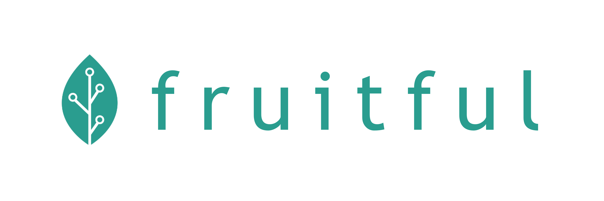

# Fruitful API Examples



## Setup
1. Install pip and virtualenv if you do not already have them.

2. Clone this repository:

```sh
git clone git@github.com:fruitful-farming/fruitful-api-examples.git
```

## How to run a sample

1. Change directory to one of the sample folders, e.g. `cd socket-python`

2. Create a virtualenv. Samples are compatible with Python 3.6+.

```sh
sh python3 -m venv env
source env/bin/activate
```

3. Install the dependencies needed to run the samples.

```sh
pip install -r requirements.txt
```

4. If required, add your API_KEY, SYSTEM_ID DEVICE_ID obtained from [Fruitful App](https://app.fruitful.ag)

5. Run the sample:
```
python main.py
```